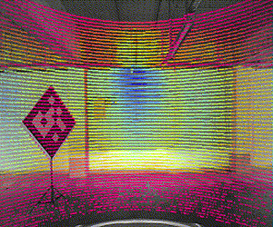

# README

## Overview
This repository contains the implementation of a Python ROS 2 node for monocular camera and 3D lidar calibration. The node processes synchronized image and point cloud data to estimate extrinsic parameters, refine 2D-3D correspondences, and perform tasks such as ArUco marker detection. This interactive tool has three steps.
- Data Acquisition (main.py)
- Optimization (optimization.py)
- Visualization (visualize.py)



## Docker Access
1. Clone the Repository: Begin by cloning the project repository from GitHub: 
``` bash 
	git clone https://github.com/tui-abdul/3d_lidar_camera_calib.git
```

2. Navigate to the Docker Directory: Move into the docker directory within the cloned repository:
```bash
	cd 3d_lidar_camera_calib/docker
```

3. Build the Docker Image: Use the provided Dockerfile to build the Docker image. Run the following command:
```bash
	docker build -t 3d_lidar_camera_calib_image .
```
4. Run the Docker Container: After building the image, you can run the Docker container using the run_docker.sh script provided in the docker directory. First, ensure the script has execute permissions:
```bash
	chmod +x run_docker.sh
```
5. Then, execute the script:
```bash
	./run_docker.sh
```

## Prerequisites

### Software Requirements
- Python 3.10.12
- ROS 2
- OpenCV
- Open3D
- CV Bridge
- pyransac3d
- matplotlib
- skspatial
- message_filters

### Installation
1. Install ROS 2 following the [official guide](https://docs.ros.org/).
2. Install the required Python libraries:
   ```bash
   pip3 install -r requirement.txt
   ```
3. Clone the repository and navigate to the working directory.

## Usage

### Input
The node subscribes to the following topics:
- **Image Topic:** A ROS topic publishing camera images.
- **PointCloud2 Topic:** A ROS topic publishing point cloud data from the LiDAR.

### Node Initialization
To start the node, execute:
```bash
python3 main.py
```

### Parameters
The following parameters can be configured in the `front_mid_teleop.yaml` file:
- `camera_matrix`: Camera intrinsic matrix.
- `distortion_coefficients`: Camera distortion coefficients.

### Output
- Estimated extrinsic calibration parameters.
- Visualizations of processed point clouds and detected ArUco markers.

### Key Functionalities
1. **Camera-LiDAR Synchronization:** Synchronizes image and point cloud data using message filters.
2. **ArUco Marker Detection:** Detects ArUco markers in the camera images and calculates their centroids.
3. **Point Cloud Processing:**
   - Transformation of point cloud data.
   - Plane fitting and boundary detection.
4. **2D-3D Correspondences:** Projects 3D LiDAR points into 2D camera space.
5. **Interactive ROI Selection:** Allows user interaction for selecting regions of interest in point clouds.
6. **Extrinsic Parameter Estimation:** Calculates rotation and translation vectors using 2D-3D correspondences.

### User Inputs
Some functions require user input via the terminal or an interactive GUI to:
- Break or continue loops.
- Select ROIs or specific points in visualized point clouds.

### Files
- **`calib.py`**: Main ROS 2 node implementation.
- **`front_mid_teleop.yaml`**: Calibration configuration file.
- **`crop.py`**: Helper functions for ROI selection.

## Examples

### Running the Node
Ensure the `front_mid_teleop.yaml` file is correctly configured, and execute:
```bash
ros2 run <package_name> calib
```

### Visualizing Point Clouds
The node provides interactive visualizations for selecting and processing point cloud data.

## Contributions
Contributions are welcome! Please fork the repository and create a pull request with your changes.

## License
This project is licensed under

## Contact
For questions or feedback, feel free to reach out to:
- **Abdul Haq A. Paracha**
- **Email:** [Insert email here]

